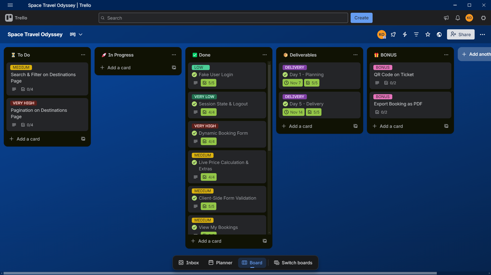

# Space Travel Odyssey — By AstroTech Studio
An interactive space tourism booking platform that transforms space travel dreams into reality.  
Developed as part of the **JavaScript Booking System Integration** brief at AstroTech Studio.

---
## Table of Contents
- [Project Overview](#project-overview)
- [Educational Objectives](#educational-objectives)
- [Pages & Navigation](#pages--navigation)
- [Screenshots](#screenshots)
- [Main Features (JavaScript)](#main-features-javascript)
- [Technologies Used](#technologies-used)
- [Development Workflow](#development-workflow)
- [Deployment](#deployment)
- [License](#license)
---

## Project Overview
**Space Travel Odyssey** is a modern, interactive web application that enables users to book their journey to space.  
Building upon a static HTML/CSS foundation, this project integrates **dynamic booking functionalities** with **JavaScript** to create a seamless, user-centric reservation experience.

The focus is on **authentication management**, **dynamic forms**, **real-time price calculation**, **CRUD operations**, **form validation**, and **ticket generation** — all powered by client-side JavaScript and browser localStorage.

---
## Educational Objectives
- Implement simulated authentication with session persistence
- Build dynamic, context-aware booking forms with intelligent field updates
- Master real-time price calculations based on user selections and passenger count
- Create full **CRUD** operations (Create, Read, Update, Delete) for reservations
- Develop comprehensive client-side form validation using regular expressions
- Generate professional, print-optimized ticket templates
- Manage data persistence using localStorage with unique identifiers
- Apply clean, maintainable JavaScript (ES6+) best practices

---
## Pages & Navigation
The site features a **consistent header and navigation** across all pages:

| Page | Link | Description |
|------|------|-----------|
| **HOME** | `index.html` | Hero section, featured destinations, call-to-action |
| **DESTINATIONS** | `destinations.html` | Showcase of available space destinations |
| **BOOKING** | `booking.html` | **Interactive reservation form** with real-time pricing |
| **MY RESERVATIONS** | `reservations.html` | **Dashboard with CRUD operations** and ticket generation |
| **ABOUT US** | `about.html` | Mission and vision of Space Travel Odyssey |

**Global Features**:
- User authentication status indicator
- Login/Logout functionality
- Responsive navigation menu
- Session persistence across pages
- User profile avatar

---
## Screenshots

---
## Main Features (JavaScript)

### 1. **Authentication & Session Management**
- Simulated login system with user session tracking
- Persistent authentication state using localStorage
- Dynamic UI updates based on login status
- Secure logout with session cleanup

### 2. **Dynamic Booking System** (`booking.html`)
- **Adaptive form fields** based on destination selection
- **Real-time price calculation** with live updates
- **Multi-passenger support** with dynamic field generation
- Context-aware form validation
- Booking confirmation with unique reservation ID

### 3. **Full CRUD on Reservations** (`reservations.html`)
- **Create**: New bookings via booking form
- **Read**: Display all user reservations in dashboard
- **Update**: Edit modal with pre-filled reservation data
- **Delete**: Confirmation popup before removal

### 4. **Advanced Search & Filtering**
- **Real-time search** by passenger name or reservation ID
- **Destination filter** (e.g., select "Moon" → shows all Moon trips)
- **Date range filter** for departure dates
- **Combined filters** (search + destination + date)

### 5. **Form Validation**
- **Comprehensive client-side validation** using regex patterns
- Email format validation
- Phone number format validation
- Date validation (future dates only)
- Passenger count validation
- Real-time error messaging with user-friendly feedback

### 6. **Ticket Generation & Printing**
- Professional ticket templates with all reservation details
- Print-optimized layout and styling
- Native browser print functionality
- Unique booking reference code

### 7. **Interactive UI**
- Modal popups with overlay
- Smooth transitions and feedback
- No page reloads — all updates via DOM
- Loading states and confirmation messages

---
## Technologies Used
### Front-End
- **HTML5** — Semantic, accessible structure
- **CSS3 / TailwindCSS** — Modern utility-first styling, Flexbox, Grid, Mobile First
- **JavaScript (Vanilla ES6+)** — DOM, events, localStorage, form handling, regex validation

### Data Management
- **localStorage** — Client-side data persistence
- **JSON** — Data serialization and storage format

### Tools
- **Git & GitHub** — Version control, branching, PRs
- **GitHub Pages** — Static site hosting and deployment
- **Live Server** — Local development environment
- **Figma** — Reference for layout and interactions

---
## Development Workflow
**Duration**: 5 days (November 7 – November 14, 2025)  
**Mode**: Individual  
**Process**:
1. Analyze static site and plan JavaScript enhancements
2. Implement authentication and session management system
3. Build dynamic booking form with real-time calculations
4. Create reservation management dashboard with CRUD operations
5. Add search and filtering logic
6. Implement form validation with regex patterns
7. Develop ticket generation and print functionality
8. Polish UX, test responsiveness across devices
9. Deploy and document

---
## Deployment
**Live Site**: [https://your-space-travel-odyssey.github.io](https://your-space-travel-odyssey.github.io)  
**GitHub Repository**: [https://github.com/yourusername/Space-Travel-Odyssey](https://github.com/yourusername/Space-Travel-Odyssey)

Hosted on **GitHub Pages** for fast, reliable static delivery.

---
## License
This project is for **educational purposes** under AstroTech Studio.  
© 2025 **Space Travel Odyssey**. All rights reserved.

---
## Acknowledgments
Special thanks to the AstroTech Studio team and instructors for guidance on modern JavaScript development practices and interactive web applications.

---
**Book. Explore. Travel Beyond.**  
*Space Travel Odyssey — Your journey to the stars begins here.*